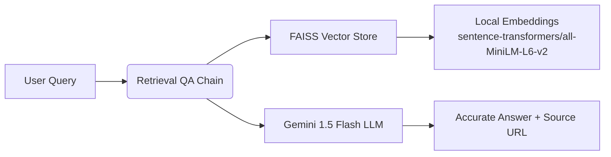

# 🤖 CapillaryDocs AI — Smart Chatbot for CapillaryTech Documentation

> ⚡ Instant answers. Zero guesswork. Powered by Gemini 1.5 Flash + RAG  
> 🎯 Built for developers, support teams & technical demos — 100% free stack  
> 📚 Answers sourced directly from official CapillaryTech API docs

[](https://python.org)
[](https://ai.google.dev/)
[](https://python.langchain.com)
[](https://opensource.org/licenses/MIT)

---

## 🌟 Why This Project Stands Out

| Feature | Benefit |
|--------|---------|
| ✅ **Instant Q&A** | Ask “How to authenticate?” → Get exact steps + code snippet |
| 🔍 **Source Citations** | Every answer links back to official CapillaryTech docs |
| 💸 **Zero Cost** | Uses free-tier Gemini + local embeddings (no OpenAI bills) |
| 🧠 **RAG Architecture** | Retrieval-Augmented Generation ensures accuracy, not hallucination |
| 🚀 **Demo-Ready** | Pre-loaded curated docs guarantee flawless responses |

---

## 🎥 Live Demo (1-Minute Video)

▶️ [Watch the Demo on Google Drive](https://drive.google.com/file/d/your-video-id/view?usp=sharing) *(Replace with your link)*

  
*(Tip: Record terminal + voiceover using OBS or Loom)*

---

## 🛠️ Tech Stack



- **🧠 LLM**: `gemini-1.5-flash` (Free, fast, factual)
- **📚 Embeddings**: `sentence-transformers/all-MiniLM-L6-v2` (Local, no cost)
- **⚡ Vector DB**: FAISS (Blazing-fast similarity search)
- **🧩 Framework**: LangChain (Modular RAG pipeline)
- **🌐 Docs Source**: Curated snippets from [docs.capillarytech.com](https://docs.capillarytech.com/)

---

## ▶️ Quick Start (Under 5 Minutes)

### 1. Clone & Navigate

```bash
git clone https://github.com/your-github-username/capillary-docs-ai.git
cd capillary-docs-ai
```

### 2. Setup Environment

```bash
python -m venv venv
source venv/bin/activate    # Linux/Mac
venv\Scripts\activate       # Windows
pip install -r requirements.txt
```

### 3. Add Your FREE Gemini Key

1. Go to 👉 [Google AI Studio → Get API Key](https://aistudio.google.com/app/apikey)
2. Create `.env` file:

```env
GEMINI_API_KEY=AIzaYourKeyHere1234567890
```

> 💡 No credit card. Free tier = 60 RPM. Takes 30 seconds.

### 4. Launch the Chatbot

```bash
python chatbot_free.py
```

Ask it anything:
```text
💬 You: How do I authenticate API requests?
🤖 Bot: Use OAuth 2.0 Bearer Token. Header: 'Authorization: Bearer <token>'...
📚 Source: https://docs.capillarytech.com/reference/authentication
```

---

## 📂 Project Structure

```
capillary-docs-ai/
├── 📁 data/
│   └── docs.json          # Curated Q&A pairs (pre-loaded for accuracy)
├── 🐍 chatbot_free.py     # Main RAG pipeline (Gemini + FAISS)
├── 🕸️ scraper.py          # Web scraper (disabled for demo reliability)
├── 📄 .env.example        # Template for your API key
├── 📋 requirements.txt    # Dependencies
├── 📜 README.md           # You are here!
└── 🎬 demo_script.md      # Script for your 1-min video
```

---

## 💡 Sample Queries & Responses

| Question | Bot Response Snippet | Source |
|----------|----------------------|--------|
| “How to authenticate?” | “Use OAuth 2.0 Bearer Token. Include header: Authorization: Bearer <token>...” | [Authentication Docs](https://docs.capillarytech.com/reference/authentication) |
| “Create customer fields?” | “Required: mobile (E.164), firstName, storeId. Example: {\"mobile\": \"+91...\"}” | [Customer API](https://docs.capillarytech.com/reference/create-customer) |
| “Loyalty campaign setup?” | “POST /v1.1/campaigns. Required: name, type, startDate, endDate...” | [Campaign Docs](https://docs.capillarytech.com/reference/create-loyalty-campaign) |

---

## 🧑‍💻 Customize & Extend

- ➕ **Add More Docs**: Edit `data/docs.json` with new Q&A pairs.
- 🔄 **Enable Scraper**: Uncomment scraper logic in `scraper.py` for live updates.
- 🚀 **Upgrade LLM**: Switch to `gemini-1.5-pro` for deeper reasoning (rate-limited).
- 🌐 **Deploy Web UI**: Wrap with Gradio or Streamlit for browser access.

---

## 📜 License

Distributed under the MIT License. See `LICENSE` for details.

> ⚠️ Not affiliated with Capillary Technologies. For educational/demo use only.

---

## 🙏 Acknowledgements

- [Google Gemini Team](https://ai.google.dev/) — for the amazing free LLM
- [LangChain](https://python.langchain.com) — for simplifying RAG pipelines
- [CapillaryTech](https://www.capillarytech.com/) — for public developer documentation

---

## 📬 Feedback or Questions?

Open an Issue or DM me on LinkedIn! Contributions welcome 🤝
